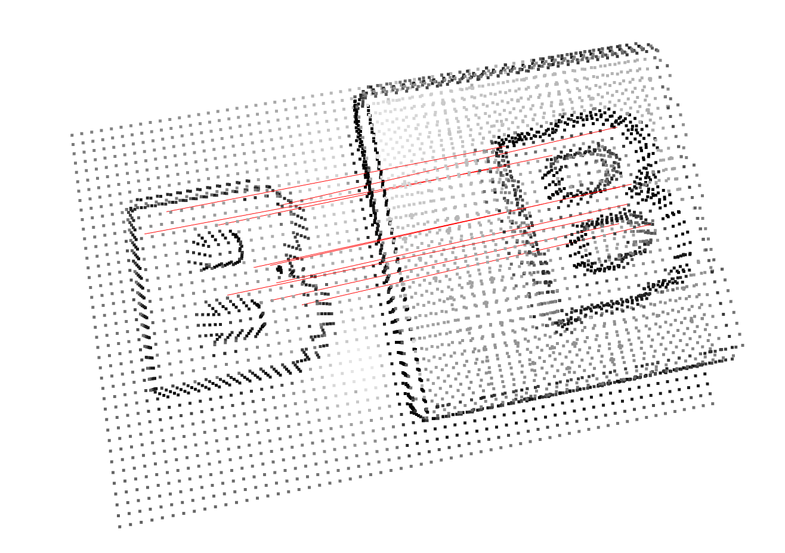
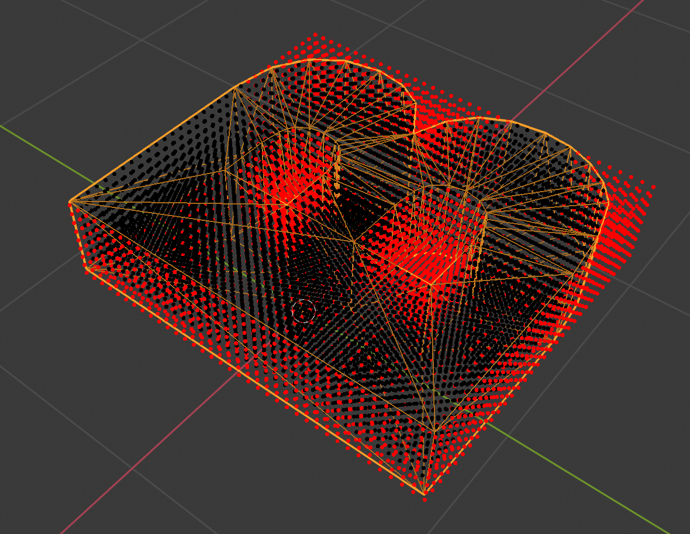

# 3DMatching via Dense Voxel-Wise Descriptor in Tensroflow
In this project, we learned dense voxel-space descriptor by porjecting single RGB-D image to TSDF(truncated signed distance function) volume. Ground truth label is acquired through blender where object pose, camera matrices are recorded.


## Prerequisites
* Blender 2.8
* Python > 3.6.4
* Tensorflow == 2.0
* numpy == 1.17.2             
* opencv-contrib-python == 4.1.1.26 
* Open3d == 0.8.0.0
* scikit-learn == 0.21.3  
* tqdm == 4.36.1 

For blender download please visit blender [offical website].

## Usage
* Mesh files are in the env/mesh folder
* When processing mesh files you can either open the blender, open data_gen.py file, and run the script. Or you can run the script in command line 

```
where the script is ...
```
* The script will give you object pose, camera pose, camera intrinsic matrix, and the RGB-D images of objects and its corresponding packages. Below is a example of objects and its corresponding package and visualiztion of the matching in on the image level.

[photo]

* Run the following command to acquire TSDF volume and correspondence between object and packages. Configuration can be find in the config file.
```
python ./TSDF_Matching_Label/main.py
```
  * Below is the example of the reconstrucuted volume from TSDF and its corresponding matching in 3d space


  * All the point is sampled within the body mesh from dense point cloud grid. Below is the visualization of the point cloud grid. 

* To train the model run the following command.
```
python ./Model/train.py
```

A few motivating and useful examples of how your product can be used. Spice this up with code blocks and potentially more screenshots.

_For more examples and usage, please refer to the [Wiki][wiki]._

## Development setup

Describe how to install all development dependencies and how to run an automated test-suite of some kind. Potentially do this for multiple platforms.

```sh
make install
npm test
```


## Meta

Your Name – [@YourTwitter](https://twitter.com/dbader_org) – YourEmail@example.com

Distributed under the XYZ license. See ``LICENSE`` for more information.

[https://github.com/yourname/github-link](https://github.com/dbader/)

## Contributing

1. Fork it (<https://github.com/yourname/yourproject/fork>)
2. Create your feature branch (`git checkout -b feature/fooBar`)
3. Commit your changes (`git commit -am 'Add some fooBar'`)
4. Push to the branch (`git push origin feature/fooBar`)
5. Create a new Pull Request

<!-- Markdown link & img dfn's -->
[offical website]: https://www.blender.org/download/
[npm-image]: https://img.shields.io/npm/v/datadog-metrics.svg?style=flat-square
[npm-url]: https://npmjs.org/package/datadog-metrics
[npm-downloads]: https://img.shields.io/npm/dm/datadog-metrics.svg?style=flat-square
[travis-image]: https://img.shields.io/travis/dbader/node-datadog-metrics/master.svg?style=flat-square
[travis-url]: https://travis-ci.org/dbader/node-datadog-metrics
[wiki]: https://github.com/yourname/yourproject/wiki
