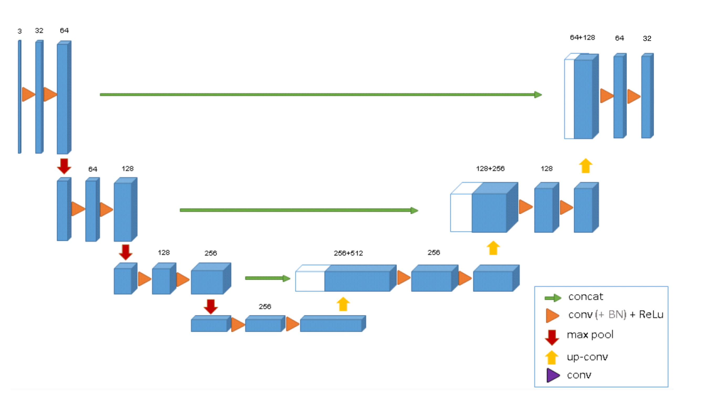
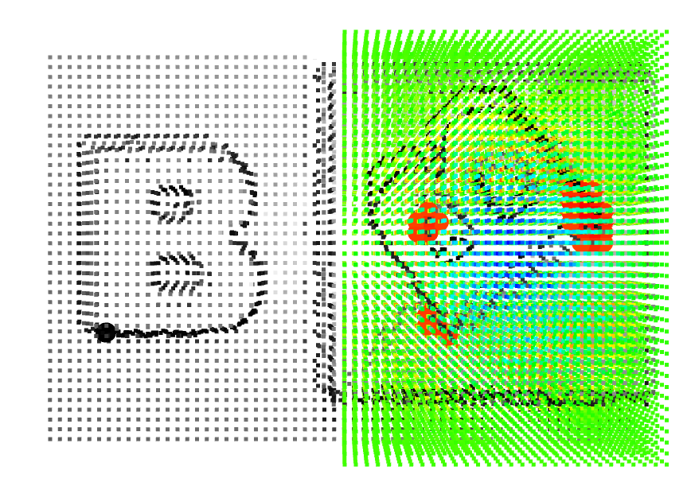
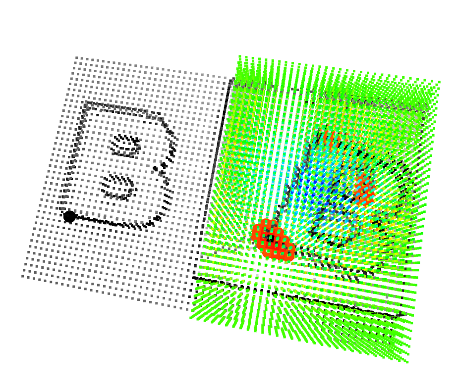
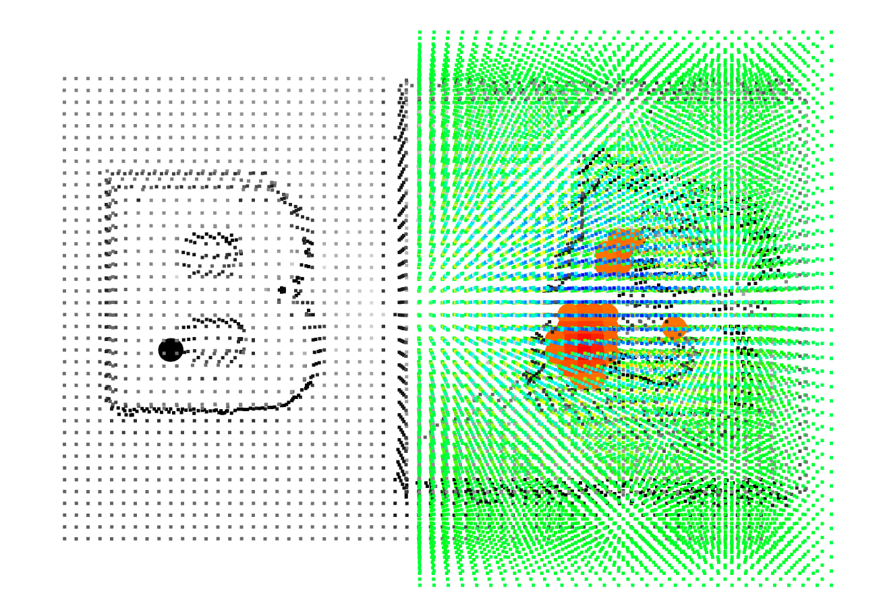
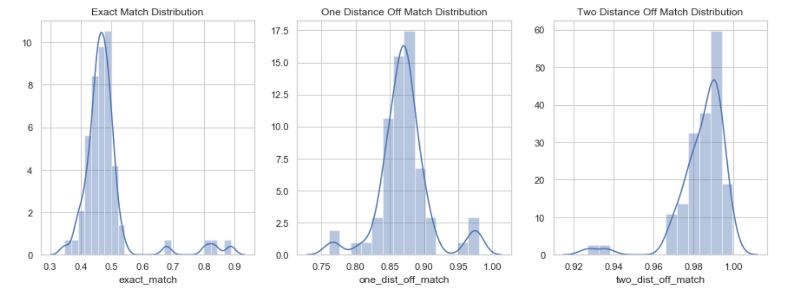
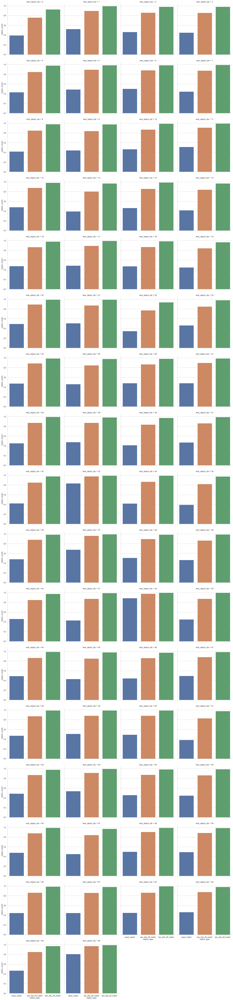

# 3DMatching via Dense Voxel-Wise Descriptor in Tensroflow
In this project, we learned dense voxel-space descriptor by projecting single RGB-D image to TSDF(truncated signed distance function) volume. Ground truth label is acquired through blender where object pose, camera matrices are recorded.


## Prerequisites
* Blender == 2.8
* Python > 3.6.4
* Tensorflow == 2.0
* numpy == 1.17.2             
* opencv-contrib-python == 4.1.1.26 
* Open3d == 0.8.0.0
* scikit-learn == 0.21.3  
* tqdm == 4.36.1 

For blender download please visit blender [official website].

## Usage
* Mesh files are in the env/mesh folder
* When processing mesh files you can follow the command blow. If you install blender in different path, then use your own blender path. 

```
/Applications/Blender.app/Contents/MacOS/Blender --background --python data_generation.py
```
* The script will give you object pose, camera pose, camera intrinsic matrix, and the RGB-D images of objects and its corresponding packages. Below is a example of objects and its corresponding package and visualization of the matching in on the image level.


* Run the following command to acquire TSDF volume and correspondence between object and packages. Configuration can be find in the config file.
```
python ./TSDF_Matching_Label/main.py
```
  * Below is the example of the reconstructed volume from TSDF and its corresponding matching in 3d space


  * All the points are sampled within the body mesh from dense point cloud grid. Below is the visualization of the point cloud grid. 

* To train the model run the following command.
```
python ./Model/train.py
```
* The validation file (On Going)

## Voxel Feature Learning Model Architecture
 
I used 3D U_Net to learn dense voxel-wise feature, and this feature will be used to estimate 12 DOF rigid body transformation . All the 3D convolution has kernel size 3 x 3 x 3. 

## Qualitative Assessment




Above graph are the 3D heat map(point cloud) for the package. The heat map is based on the l2 difference of learned feature between the ground truth in the object(left half of the point cloud), a black point, and all the voxel space in the package. The red dots represents the top 30 corresponding voxels. As show in the figures above, the model predicts points with similar geometry tend to have smaller feature distance distance which is constant with our intuition . The color itself is picked from hsv color palette where hue has value range from 0 degree to 240 degree. Red color indicates smaller l2 distance and blue color indicates large l2 distance. 

## Quantitative Assessment
#### Distribution of matching 

#### Matching for each individual objects


Above graph shows that based on learned descriptor, how well the ground truth matching is recovered. Three scenarios are considered: exactly match, one distance off match(distance between predicted matching and ground truth matching <= 1), two distance off match(distance between predicted matching and ground truth matching <= 2). Testing is done via entire 66 testing objects. The descriptor is able to correctly recover the ground truth on average around 45% of the time. If addition tolerance is allowed, based on learned descriptor, around 85% or even around 95% of the ground truth can be recovered. Since truncated signed distance function of a single RGB-D of an object only gives a rough estimation of the object mesh, it is reasonable to assume certain degree of tolerance during testing.

## Future Work

1.Currently, the object I used is a single letter 'B'. In the future, more objects with more complex geometry will be included to test its ability to generalize. 

2.Include trained matching network to perform different tasks, such as robotic assembly.

## Reference
```
@inproceedings{zeng20163dmatch, 
    title={3DMatch: Learning Local Geometric Descriptors from RGB-D Reconstructions}, 
    author={Zeng, Andy and Song, Shuran and Nie{\ss}ner, Matthias and Fisher, Matthew and Xiao, Jianxiong and Funkhouser, Thomas}, 
    booktitle={CVPR}, 
    year={2017} 
}

@article{jang2018grasp2vec,
  title={Grasp2vec: Learning object representations from self-supervised grasping},
  author={Jang, Eric and Devin, Coline and Vanhoucke, Vincent and Levine, Sergey},
  journal={arXiv preprint arXiv:1811.06964},
  year={2018}
}
